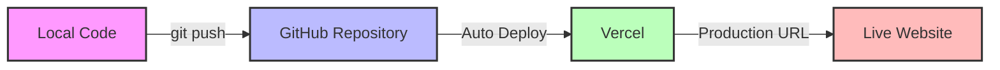

# 🚀 Hướng Dẫn Deploy: GitHub → Vercel

> Hướng dẫn chi tiết từng bước để deploy ứng dụng **Luyện thi Chứng chỉ hành nghề Xây dựng** từ GitHub lên Vercel.

---

## 📋 Tổng Quan Quy Trình



**Workflow:**
1. 💻 Code trên máy local
2. 📤 Push lên GitHub
3. 🚀 Vercel tự động build & deploy
4. 🌐 Website live với HTTPS miễn phí

---

## ✅ Yêu Cầu Trước Khi Bắt Đầu

### Tài Khoản Cần Thiết
- [ ] [GitHub Account](https://github.com/signup) - Miễn phí
- [ ] [Vercel Account](https://vercel.com/signup) - Miễn phí (đăng nhập bằng GitHub)
- [ ] [Supabase Project](https://supabase.com) - Đã setup database

### Credentials Cần Chuẩn Bị
- [ ] Supabase URL & API Keys
- [ ] PayOS Credentials (nếu có payment)
- [ ] Resend API Key (nếu có email)

### Kiểm Tra Build Local
```bash
# Đảm bảo build thành công trên máy local
npm run build
```

> [!IMPORTANT]
> Nếu `npm run build` **KHÔNG** thành công local, **TUYỆT ĐỐI KHÔNG** deploy lên Vercel!

---

## 🔧 PHẦN 1: Chuẩn Bị GitHub Repository

### Bước 1.1: Kiểm Tra Git Status

```bash
# Di chuyển vào thư mục project
cd "e:\2026\Webapp\15. Sát hach CCHN\luyenthichungchixd"

# Kiểm tra git status
git status
```

**Nếu thấy "No commits yet" và "Untracked files":**
```
On branch main
No commits yet

Untracked files:
  (use "git add <file>..." to include in what will be committed)
        .agent/
        .env.local.example
        .gitignore
        ...
```

**✅ Đây là bình thường!** Tiếp tục bước 1.2 để add và commit files.

**Nếu chưa có Git:**
```bash
# Khởi tạo git repository
git init

# Kiểm tra .gitignore đã có chưa
# File .gitignore PHẢI có các dòng sau:
# node_modules/
# .next/
# .env.local
# .env*.local
```

> [!IMPORTANT]
> Trước khi commit, **PHẢI kiểm tra** file `.gitignore` đã có các dòng sau:
> ```
> node_modules/
> .next/
> .env.local
> .env*.local
> ```
> Điều này đảm bảo không commit sensitive data và build files lên GitHub!

### Bước 1.2: Commit Code

```bash
# Thêm tất cả files (trừ những files trong .gitignore)
git add .

# Kiểm tra lại những gì sẽ được commit
git status

# Nếu thấy node_modules/ hoặc .env.local trong danh sách → DỪNG LẠI!
# Cập nhật .gitignore và chạy: git reset

# Commit với message rõ ràng
git commit -m "chore: prepare for Vercel deployment"
```

**Xác nhận commit thành công:**
```bash
# Kiểm tra commit history
git log --oneline

# Bạn sẽ thấy:
# abc1234 (HEAD -> main) chore: prepare for Vercel deployment
```


### Bước 1.3: Tạo GitHub Repository

**Cách 1: Qua GitHub Web UI**
1. Truy cập https://github.com/new
2. **Repository name**: `luyen-thi-chung-chi-xd` (hoặc tên bạn muốn)
3. **Visibility**: Private hoặc Public (tùy bạn)
4. ⚠️ **KHÔNG** chọn "Add README" hoặc ".gitignore" (vì đã có local)
5. Click **Create repository**

**Cách 2: Qua GitHub CLI** (nếu đã cài `gh`)
```bash
gh repo create luyen-thi-chung-chi-xd --private --source=. --remote=origin
```

### Bước 1.4: Push Code Lên GitHub

```bash
# Thêm remote origin (thay YOUR_USERNAME bằng username GitHub của bạn)
git remote add origin https://github.com/YOUR_USERNAME/luyen-thi-chung-chi-xd.git

# Đổi branch sang main (nếu đang là master)
git branch -M main

# Push code lên GitHub
git push -u origin main
```

**Xác nhận thành công:**
- Truy cập `https://github.com/YOUR_USERNAME/luyen-thi-chung-chi-xd`
- Bạn sẽ thấy toàn bộ code đã được push lên

---

## 🌐 PHẦN 2: Deploy Lên Vercel

### Bước 2.1: Kết Nối Vercel Với GitHub

1. Truy cập https://vercel.com/dashboard
2. Click **Add New** → **Project**
3. Nếu lần đầu, Vercel sẽ yêu cầu kết nối với GitHub:
   - Click **Continue with GitHub**
   - Authorize Vercel truy cập GitHub của bạn
   - Chọn **All repositories** hoặc **Only select repositories**

### Bước 2.2: Import Repository

1. Trong danh sách repositories, tìm `luyen-thi-chung-chi-xd`
2. Click **Import** bên cạnh repository đó

### Bước 2.3: Cấu Hình Project

Vercel sẽ tự động detect Next.js và điền sẵn:

| Setting | Value | Note |
|---------|-------|------|
| **Framework Preset** | Next.js | Auto-detected ✅ |
| **Root Directory** | `./` | Giữ nguyên |
| **Build Command** | `next build` | Giữ nguyên |
| **Output Directory** | `.next` | Giữ nguyên |
| **Install Command** | `npm install` | Giữ nguyên |

> [!TIP]
> **Không cần thay đổi gì** ở phần này, Vercel đã tự động cấu hình đúng!

---

## 🔐 PHẦN 3: Cấu Hình Environment Variables

> [!CAUTION]
> Đây là bước **QUAN TRỌNG NHẤT**! Thiếu hoặc sai env vars → App sẽ crash!

### Bước 3.1: Mở Environment Variables Settings

Trong trang Import Project, scroll xuống phần **Environment Variables**

### Bước 3.2: Thêm Supabase Variables

Click **Add** và nhập từng biến sau:

#### Variable 1: NEXT_PUBLIC_SUPABASE_URL
```
Key:   NEXT_PUBLIC_SUPABASE_URL
Value: https://your-project-id.supabase.co
```

#### Variable 2: NEXT_PUBLIC_SUPABASE_ANON_KEY
```
Key:   NEXT_PUBLIC_SUPABASE_ANON_KEY
Value: eyJhbGciOiJIUzI1NiIsInR5cCI6IkpXVCJ9...
```

#### Variable 3: SUPABASE_SERVICE_ROLE_KEY
```
Key:   SUPABASE_SERVICE_ROLE_KEY
Value: eyJhbGciOiJIUzI1NiIsInR5cCI6IkpXVCJ9...
```

**Lấy Supabase credentials ở đâu?**
1. Vào https://supabase.com/dashboard
2. Chọn project của bạn
3. **Settings** → **API**
4. Copy:
   - **URL** → `NEXT_PUBLIC_SUPABASE_URL`
   - **anon public** → `NEXT_PUBLIC_SUPABASE_ANON_KEY`
   - **service_role** → `SUPABASE_SERVICE_ROLE_KEY` (click "Reveal" để xem)

### Bước 3.3: Thêm PayOS Variables (Nếu Có)

```
Key:   NEXT_PUBLIC_PAYOS_CLIENT_ID
Value: your-client-id

Key:   PAYOS_API_KEY
Value: your-api-key

Key:   PAYOS_CHECKSUM_KEY
Value: your-checksum-key
```

### Bước 3.4: Thêm Resend Variables (Nếu Có Email)

```
Key:   RESEND_API_KEY
Value: re_xxxxxxxxxxxxx

Key:   RESEND_FROM_EMAIL
Value: noreply@yourdomain.com
```

### Bước 3.5: Thêm Site URL

```
Key:   NEXT_PUBLIC_SITE_URL
Value: https://your-app.vercel.app
```

> [!NOTE]
> Lần đầu deploy, bạn chưa biết Vercel URL. Có thể để trống, sau khi deploy xong quay lại thêm.

**Checklist Environment Variables:**
- [ ] Tất cả keys đã nhập đúng (không có typo)
- [ ] Không có khoảng trắng thừa ở đầu/cuối value
- [ ] Đã chọn đúng environment (Production, Preview, Development)

---

## 🎯 PHẦN 4: Deploy!

### Bước 4.1: Bắt Đầu Deployment

1. Sau khi cấu hình xong Environment Variables
2. Click nút **Deploy** màu xanh

### Bước 4.2: Theo Dõi Build Process

Vercel sẽ hiển thị real-time logs:

```
▲ Vercel CLI
Installing dependencies...
Building...
Linting and checking validity of types...
Creating an optimized production build...
✓ Compiled successfully
Uploading build outputs...
✓ Deployment ready
```

**Thời gian build:** Thường 2-5 phút

### Bước 4.3: Deployment Thành Công! 🎉

Khi thấy:
```
✅ Deployment Ready
🔗 https://luyen-thi-chung-chi-xd.vercel.app
```

**Bạn đã deploy thành công!**

Click vào URL để xem website live.

---

## ⚙️ PHẦN 5: Cấu Hình Post-Deployment

### Bước 5.1: Cập Nhật NEXT_PUBLIC_SITE_URL

1. Copy Vercel URL (ví dụ: `https://luyen-thi-chung-chi-xd.vercel.app`)
2. Vào Vercel Dashboard → Project → **Settings** → **Environment Variables**
3. Tìm `NEXT_PUBLIC_SITE_URL`
4. Update value thành Vercel URL vừa copy
5. Click **Save**
6. **Redeploy**: Vào **Deployments** → Click **...** → **Redeploy**

### Bước 5.2: Cấu Hình Supabase Redirect URLs

> [!WARNING]
> **BẮT BUỘC** để authentication hoạt động!

1. Vào https://supabase.com/dashboard
2. Chọn project → **Authentication** → **URL Configuration**
3. **Site URL**: Thêm
   ```
   https://luyen-thi-chung-chi-xd.vercel.app
   ```
4. **Redirect URLs**: Thêm
   ```
   https://luyen-thi-chung-chi-xd.vercel.app/auth/callback
   https://luyen-thi-chung-chi-xd.vercel.app/*
   ```
5. Click **Save**

### Bước 5.3: Cấu Hình PayOS Webhook (Nếu Có)

1. Vào https://my.payos.vn
2. **Cài đặt** → **Webhook**
3. **Webhook URL**: 
   ```
   https://luyen-thi-chung-chi-xd.vercel.app/api/webhook/payos
   ```
4. Click **Lưu**

---

## 🧪 PHẦN 6: Testing & Verification

### Checklist Kiểm Tra Cơ Bản

- [ ] **Trang chủ** load thành công (không có lỗi 500)
- [ ] **Đăng nhập** với Google hoạt động
- [ ] **Đăng ký** tài khoản mới hoạt động
- [ ] **Database** queries hoạt động (xem được danh sách câu hỏi)
- [ ] **Responsive** trên mobile (test bằng DevTools)

### Test Authentication Flow

1. Click **Đăng nhập**
2. Chọn **Continue with Google**
3. Sau khi authorize, kiểm tra redirect về `/tai-khoan`
4. Kiểm tra profile hiển thị đúng thông tin

### Test Database Connection

1. Vào trang **Ôn tập**
2. Chọn Hạng và Chuyên ngành
3. Kiểm tra danh sách câu hỏi load ra
4. Thử làm quiz và kiểm tra lưu kết quả

### Test Payment (Nếu Có)

1. Thêm sản phẩm vào giỏ hàng
2. Checkout
3. Kiểm tra PayOS payment link
4. Test webhook (dùng PayOS sandbox)

---

## 🔄 PHẦN 7: Continuous Deployment

### Auto-Deploy Từ GitHub

Sau lần deploy đầu tiên, **mọi thay đổi trên GitHub sẽ tự động deploy**:

```bash
# Trên máy local, sau khi code xong:
git add .
git commit -m "feat: add new feature"
git push origin main

# Vercel sẽ tự động:
# 1. Detect push mới
# 2. Build project
# 3. Deploy lên production
```

### Preview Deployments

Khi tạo Pull Request:
- Vercel tự động tạo **Preview URL** riêng
- Test trước khi merge vào `main`
- Ví dụ: `https://luyen-thi-chung-chi-xd-git-feature-abc.vercel.app`

### Rollback Nếu Có Lỗi

1. Vào Vercel Dashboard → **Deployments**
2. Tìm deployment cũ hoạt động tốt
3. Click **...** → **Promote to Production**

---

## 🔧 PHẦN 8: Custom Domain (Tên Miền Riêng)

### Bước 8.1: Thêm Domain vào Vercel

1. **Vercel Dashboard** -> Project -> **Settings** -> **Domains**.
2. Click **Add**.
3. Nhập domain bạn đã mua (ví dụ: `luyenthixaydung.vn`).
4. Click **Add**.

### Bước 8.2: Cấu Hình DNS (Quan Trọng)

Vercel sẽ hiển thị các bản ghi DNS cần cấu hình tại trang quản lý tên miền của bạn (như Mat Bao, Pavietnam, Tenten...):

**1. Cho Root Domain (luyenthixaydung.vn):**
- **Type**: `A`
- **Name**: `@`
- **Value**: `76.76.21.21`

**2. Cho Subdomain (www.luyenthixaydung.vn):**
- **Type**: `CNAME`
- **Name**: `www`
- **Value**: `cname.vercel-dns.com`

> [!NOTE]
> Sau khi cấu hình, có thể mất từ 1-24 giờ để DNS có hiệu lực trên toàn thế giới.

### Bước 8.3: Cập Nhật Sau Khi Có Domain Mới

Khi tên miền chính thức đã hoạt động, bạn **BẮT BUỘC** phải cập nhật lại các nơi sau để không bị lỗi đăng nhập:

**1. Trên Vercel:**
- Cập nhật `NEXT_PUBLIC_SITE_URL` thành domain mới: `https://luyenthixaydung.vn`.
- Thực hiện **Redeploy** lại bản mới nhất.

**2. Trên Supabase (Authentication -> URL Configuration):**
- **Site URL**: Đổi thành domain mới.
- **Redirect URLs**: Thêm domain mới vào danh sách (ví dụ: `https://luyenthixaydung.vn/**`).

**3. Trên Google Cloud Console (Nếu dùng Google Login nâng cao):**
- Thêm domain mới vào mục **Authorized JavaScript origins**.
- Thêm domain mới vào mục **Authorized redirect URIs**.

---

## 🚨 Troubleshooting - Xử Lý Lỗi

### ❌ Lỗi Git: Untracked Files

**Triệu chứng:**
```
On branch main
No commits yet

Untracked files:
  (use "git add <file>..." to include in what will be committed)
        ...
```

**Fix:**
```bash
# Đây là bình thường! Chỉ cần add và commit:
git add .
git commit -m "chore: prepare for Vercel deployment"
```

---

### ❌ Lỗi Git: Accidentally Committed node_modules/

**Triệu chứng:**
- Push lên GitHub rất lâu (hàng GB)
- Thấy `node_modules/` trong GitHub repository

**Fix:**
```bash
# 1. Xóa node_modules/ khỏi Git (nhưng giữ lại trên máy)
git rm -r --cached node_modules/

# 2. Đảm bảo .gitignore có dòng này
echo "node_modules/" >> .gitignore

# 3. Commit lại
git add .gitignore
git commit -m "fix: remove node_modules from git"

# 4. Force push (nếu đã push lên GitHub)
git push origin main --force
```

---

### ❌ Lỗi Git: .env.local Bị Commit

**Triệu chứng:**
- File `.env.local` xuất hiện trên GitHub
- **NGUY HIỂM**: API keys bị lộ công khai!

**Fix NGAY:**
```bash
# 1. Xóa .env.local khỏi Git
git rm --cached .env.local

# 2. Cập nhật .gitignore
echo ".env.local" >> .gitignore
echo ".env*.local" >> .gitignore

# 3. Commit
git add .gitignore
git commit -m "fix: remove sensitive .env.local"
git push origin main --force

# 4. QUAN TRỌNG: Rotate tất cả API keys đã bị lộ!
# - Tạo Supabase service key mới
# - Tạo PayOS credentials mới
# - Tạo Resend API key mới
```

---

### ❌ Lỗi: Build Failed - Next.js Config

**Triệu chứng:**
```
⚠ Invalid next.config.ts options detected:
⚠ Unrecognized key(s) in object: 'eslint'
```

**Fix:**
1. Mở `next.config.ts`
2. Xóa block `eslint`:
```typescript
// XÓA ĐOẠN NÀY
eslint: {
    ignoreDuringBuilds: false,
},
```
3. Commit & push lại

---

### ❌ Lỗi: supabaseUrl is required (VERCEL BUILD)

**Triệu chứng:**
```
Error occurred prerendering page "/on-tap/quiz"
Error: supabaseUrl is required.
    at <unknown> (.next/server/chunks/ssr/lib_supabase_client_ts...)
Export encountered an error, exiting the build.
⨯ Next.js build worker exited with code: 1
```

**Nguyên nhân:** 
Environment variables **CHƯA ĐƯỢC CÀI ĐẶT** trên Vercel!

**Fix:**

> [!CAUTION]
> Đây là lỗi **CỰC KỲ PHỔ BIẾN** khi deploy lần đầu!

**Bước 1: Kiểm tra Environment Variables**
1. Vào Vercel Dashboard → Project → **Settings** → **Environment Variables**
2. Kiểm tra có đủ 3 biến Supabase:
   - `NEXT_PUBLIC_SUPABASE_URL`
   - `NEXT_PUBLIC_SUPABASE_ANON_KEY`
   - `SUPABASE_SERVICE_ROLE_KEY`

**Bước 2: Nếu thiếu, thêm ngay:**
```
Key:   NEXT_PUBLIC_SUPABASE_URL
Value: https://your-project-id.supabase.co
Env:   Production, Preview, Development (chọn tất cả)

Key:   NEXT_PUBLIC_SUPABASE_ANON_KEY
Value: eyJhbGciOiJIUzI1NiIsInR5cCI6IkpXVCJ9...
Env:   Production, Preview, Development (chọn tất cả)

Key:   SUPABASE_SERVICE_ROLE_KEY
Value: eyJhbGciOiJIUzI1NiIsInR5cCI6IkpXVCJ9...
Env:   Production, Preview, Development (chọn tất cả)
```

**Bước 3: Redeploy**
1. Vào **Deployments** tab
2. Click **...** bên cạnh deployment failed
3. Click **Redeploy**

**Bước 4: Verify**
- Build sẽ thành công lần này
- Kiểm tra logs không còn lỗi `supabaseUrl is required`

> [!TIP]
> **Luôn nhớ**: Environment variables phải được set **TRƯỚC KHI** deploy. Nếu thêm sau, phải **Redeploy**!

---

### ❌ Lỗi: Missing Suspense Boundary

**Triệu chứng:**
```
⨯ useSearchParams() should be wrapped in a suspense boundary
```

**Fix:**
```typescript
import { Suspense } from 'react'

function PageContent() {
    const searchParams = useSearchParams() // Hook ở đây
    // ... component logic
}

export default function Page() {
    return (
        <Suspense fallback={<div>Loading...</div>}>
            <PageContent />
        </Suspense>
    )
}
```

---

### ❌ Lỗi: Environment Variables Not Working

**Triệu chứng:**
- App không kết nối được Supabase
- 401 Unauthorized errors

**Fix:**
1. Vào Vercel → **Settings** → **Environment Variables**
2. Kiểm tra:
   - [ ] Keys đúng chính tả
   - [ ] Values không có khoảng trắng thừa
   - [ ] Đã chọn đúng environment (Production)
3. Sau khi sửa, **Redeploy**

---

### ❌ Lỗi: Google Login / OAuth Không Hoạt Động

**Triệu chứng:**
- Khi click "Đăng nhập với Google", app báo lỗi hoặc redirect không đúng.
- Làm việc bình thường ở `localhost` nhưng lỗi trên `vercel.app`.

**Nguyên nhân:**
Supabase chưa biết URL chính thức của website bạn trên production, nên nó không cho phép redirect về đó sau khi xác thực xong.

**Fix (3 bước cực kỳ quan trọng):**

**1. Cập nhật Site URL trong Supabase:**
- Vào [Supabase Dashboard](https://supabase.com/dashboard) -> **Authentication** -> **URL Configuration**.
- **Site URL**: Thay `http://localhost:3000` thành URL Vercel của bạn (ví dụ: `https://luyenthichungchi-xxx.vercel.app`).

**2. Thêm Redirect URLs:**
- Cũng trong trang đó, mục **Redirect URLs**, thêm:
  - `https://your-app.vercel.app/**` (để hỗ trợ tất cả các sub-paths).
  - `https://your-app.vercel.app/auth/callback` (đường dẫn xử lý xác thực).

**3. Cấu hình NEXT_PUBLIC_SITE_URL trên Vercel:**
- Vào **Vercel Dashboard** -> **Settings** -> **Environment Variables**.
- Đảm bảo `NEXT_PUBLIC_SITE_URL` trùng khớp với URL website của bạn.
- **Quan trọng**: Sau khi sửa Env Var, bạn phải **Redeploy** lại bản build mới nhất!

> [!TIP]
> Nếu bạn sử dụng Google Cloud Console để cấu hình Client ID riêng cho Google Login, hãy nhớ thêm URL Vercel vào danh sách **Authorized redirect URIs** trong Google Cloud Console nữa nhé.

---

### ❌ Lỗi: 500 Internal Server Error

**Triệu chứng:**
- Trang hiển thị "500 Internal Server Error"

**Debug:**
1. Vào Vercel Dashboard → **Functions**
2. Click vào function bị lỗi
3. Xem **Logs** để biết lỗi cụ thể
4. Thường do:
   - Environment variables thiếu
   - Database connection failed
   - API route lỗi logic

---

## 📊 Monitoring & Analytics

### Vercel Analytics

1. Vào Project → **Analytics**
2. Xem:
   - 📈 Page views
   - 👥 Unique visitors
   - ⚡ Performance metrics (Web Vitals)
   - 🌍 Geographic distribution

### Function Logs

1. Vào **Functions** tab
2. Real-time logs của API routes
3. Filter by status code, time range

### Performance Insights

- **Lighthouse Score**: Vercel tự động chạy
- **Web Vitals**: LCP, FID, CLS
- **Bundle Size**: Theo dõi bundle size qua thời gian

---

## 📝 Checklist Tổng Hợp

### ✅ Pre-Deployment
- [ ] `npm run build` thành công local
- [ ] `.gitignore` có `node_modules/`, `.next/`, `.env.local`
- [ ] Code đã commit và push lên GitHub
- [ ] Environment variables đã chuẩn bị

### ✅ Deployment
- [ ] Repository đã import vào Vercel
- [ ] Environment variables đã cấu hình đầy đủ
- [ ] Build thành công trên Vercel
- [ ] Website accessible qua Vercel URL

### ✅ Post-Deployment
- [ ] `NEXT_PUBLIC_SITE_URL` đã update với Vercel URL
- [ ] Supabase Redirect URLs đã cấu hình
- [ ] PayOS Webhook đã cấu hình (nếu có)
- [ ] Authentication hoạt động
- [ ] Database queries hoạt động
- [ ] Payment flow hoạt động (nếu có)

### ✅ Optional
- [ ] Custom domain đã setup
- [ ] DNS records đã cấu hình
- [ ] SSL certificate active (Vercel tự động)
- [ ] Analytics đã enable

---

## 🎓 Best Practices

### 1. Git Workflow

```bash
# Feature development
git checkout -b feature/new-feature
# ... code ...
git commit -m "feat: add new feature"
git push origin feature/new-feature
# Tạo PR trên GitHub → Vercel tạo preview deployment
# Merge PR → Auto deploy to production
```

### 2. Environment Variables Management

| Environment | Khi Nào Dùng |
|-------------|--------------|
| **Production** | Branch `main` |
| **Preview** | Pull Requests, branches khác |
| **Development** | Local development (`.env.local`) |

### 3. Security Checklist

- ✅ Không commit `.env` files
- ✅ Sử dụng `NEXT_PUBLIC_` prefix cho client-side vars
- ✅ Service keys chỉ dùng server-side
- ✅ Enable Vercel Authentication (nếu cần)
- ✅ Cấu hình CORS đúng cách

### 4. Performance Optimization

- ✅ Sử dụng Next.js Image component
- ✅ Enable ISR (Incremental Static Regeneration)
- ✅ Code splitting tự động
- ✅ Optimize bundle size (check Vercel Analytics)

---

## 📚 Tài Liệu Tham Khảo

### Official Docs
- [Vercel Documentation](https://vercel.com/docs)
- [Next.js on Vercel](https://vercel.com/docs/frameworks/nextjs)
- [Supabase with Next.js](https://supabase.com/docs/guides/getting-started/quickstarts/nextjs)

### Community
- [Vercel Discord](https://vercel.com/discord)
- [Supabase Discord](https://discord.supabase.com)
- [Next.js GitHub Discussions](https://github.com/vercel/next.js/discussions)

---

## ✅ Kết Luận

Chúc mừng! 🎉 Bạn đã deploy thành công ứng dụng **Luyện thi Chứng chỉ hành nghề Xây dựng** lên Vercel!

### Những Gì Bạn Đã Có:
- ✅ Website live với HTTPS miễn phí
- ✅ Auto-deployment từ GitHub
- ✅ Preview deployments cho mỗi PR
- ✅ Global CDN (website nhanh trên toàn cầu)
- ✅ Analytics & monitoring built-in

### Next Steps:
1. 📊 Monitor performance qua Vercel Analytics
2. 🐛 Collect user feedback và fix bugs
3. 🚀 Iterate và thêm features mới
4. 📈 Scale khi traffic tăng (Vercel tự động scale)

---

> **Cập nhật:** 28/01/2026 | **Version:** 2.0 | **Workflow:** GitHub → Vercel
